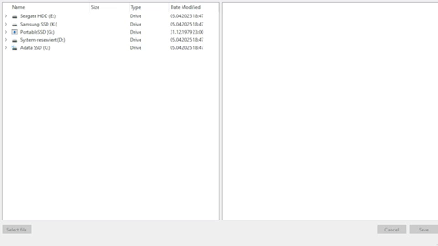

# QT GUI

Dieses Projekt erstellt mit dem QT framework und C++ ein Nutzerinterface 

## Funktionalität

Bestimmte Dateitypen[1] lassen sich in einem Fileviewer auswählen, die in ein Textfeld zum bearbeiten geparsed werden.

## Showcase

## TODO

* Multiple Dateiuntersützung
* Bearbeiten und Speichern der Datei

[1] Dateitypen:
* .csv
